# Assignment 4

## 2.0	DATA DEFINTION

The Data Definition Language (DDL) is used to create, save and delete tables; create and delete views and indexes.  The DDL is also used to modify the storage structure of tables.  The DDL commands are:

* CREATE  -  create table/view/index

* ALTER    -  modify table

* DROP     -  remove table/view/index

The general syntax of the CREATE TABLE command is:

```
CREATE TABLE table_name (field_name field_type [ NOT NULL ] [ {, field_name field_type [ NOT NULL ] } ] …)
```

Example – To create the three tables of the example database
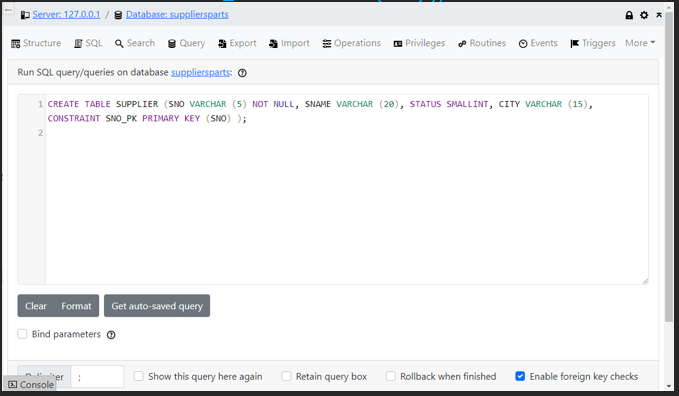
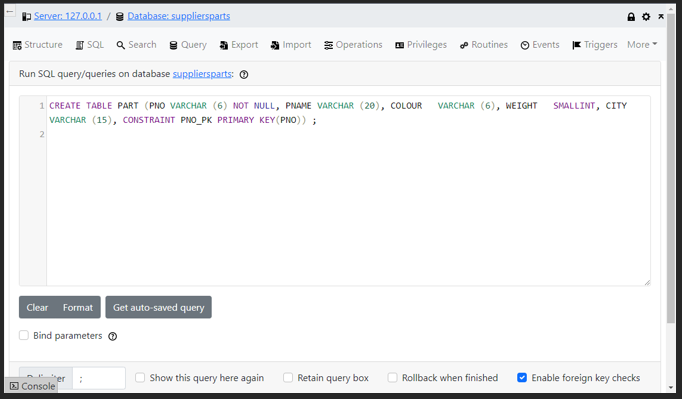
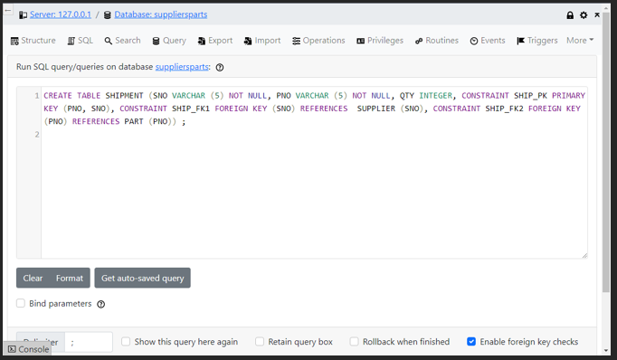
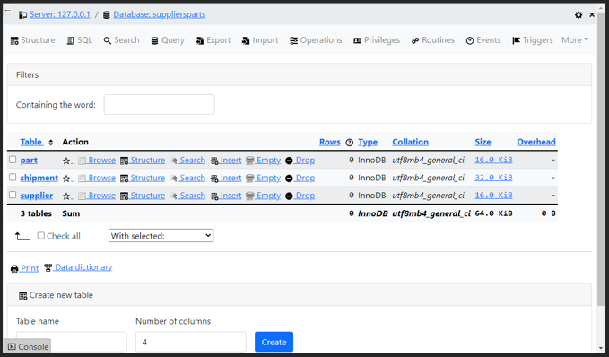
SAMPLE DATA:
PART Nos: P1, P2, P3, P4, P5, P6, P7, P8, P9, P10
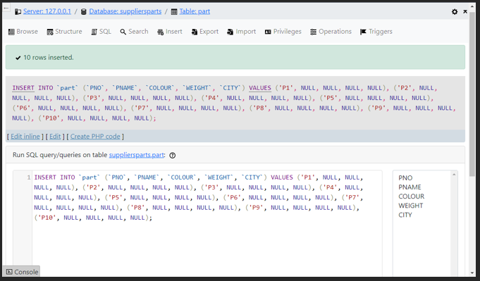
SUPPLIER Nos: S1, S2, S3;
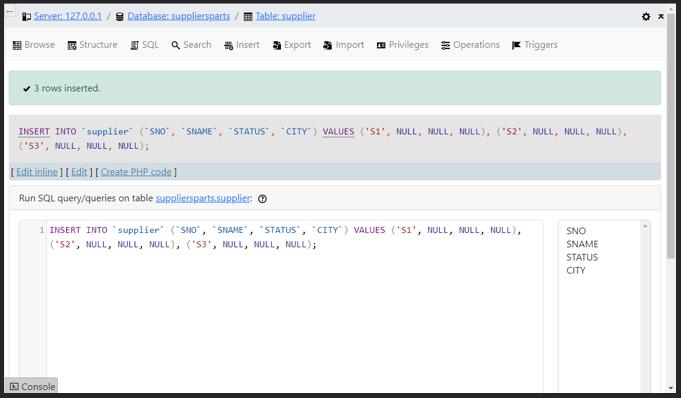
STATUS: 10, 20, 30
To delete a table use the following command:
DROP TABLE table_name
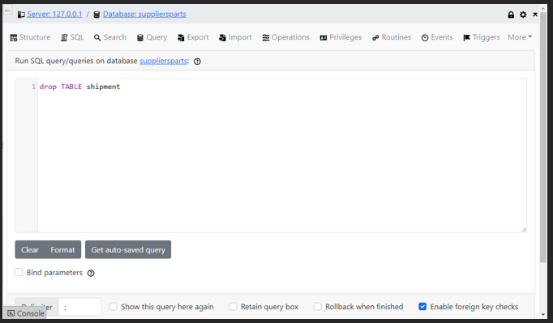
SQL supports the following data types:

* CHAR - Character                  REAL - Real
* INTEGER - Integer (fullword)      NUMERIC - Real
* SMALLINT - Integer(halfword)      DECIMAL - Real
* FLOAT - Floating Point            DOUBLE PRECISION - Real

## DATA MANIPULATION

The Data Manipulation Language (DML) commands are:

    SELECT - Extracts records from a table
    INSERT - Enters records into a table
    UPDATE - Changes the values of fields in a record
    DELETE - Removes records from a table

### SELECT

The select command extracts data from a table.  The result can be displayed, printed or saved.  The general syntax is:

    SELECT [DISTINCT] [ *: field_name {field_name} …] FROM table_name [ { , table_name} …] [WHERE condition][ [ GROUP BY grouping_criteria] [HAVING predicate] ]
    [ORDER BY ordering_criteria]

The WHERE clause is used to introduce conditions.  The following are the relational operators:

    =   Equal to
    >   Greater than
    <   Less than
    <> Not equal to
    >= Greater than or equal to
    <= Less than or equal to

    IN  Equal to an element of

    BETWEEN…AND   True if left value lies in inclusive interval specified by BETWEEN  and AND.

    EXISTS Used only with subqueries. True if subquery returns at least one record.
    ALL/ANY/SOME Used only with suybqueries.

    LIKE Used in pattern matching
    IS NULL Used in searches to determine whether a field contains a value. Returns true if field empty.

The following are the logical operators:

    AND   True if both expressions are true
    NOT   Negation
    OR     True if one or both expressions are true
    XOR   True if one expresses is true, but not both.

The ORDER BY clause is used to sort the records and may be followed by the field name whose values indicate the order of sorting.  These are ASC (ASCENDING) or DESC (DESCENDING).  ASC is the default.


The GROUP BY clause allows you to group the results of a SELECT command.

The HAVING clause has the same effect with the GROUP by as WHERE has on individual records.

SQL includes only simple statistics as standard functions.  These are:

    AVG - Average
    COUNT - Number
    MAX - Maximum
    MIN - Minimum
    SUM - Summation

The SELECT  command may be nested into subqueries using parentheses.  The innermost subquery is executed first.

Examples

1. Simple retrieval    -  Get part numbers for all parts supplied.
SELECT PNO
FROM SHIPMENT

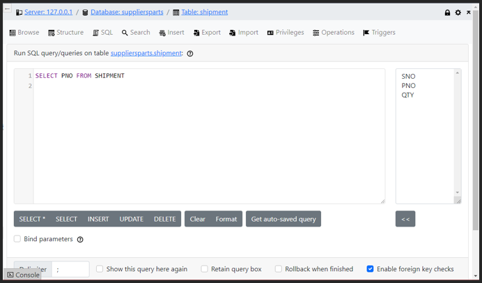
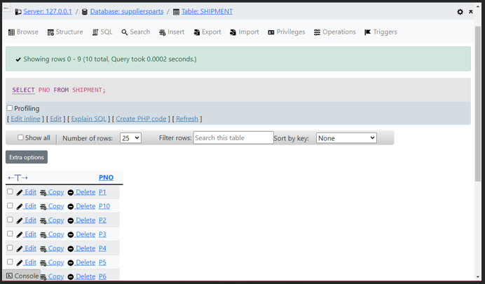

2. Simple retrieval    -  Get full details of all suppliers.
```
SELECT * FROM SUPPLIER
```

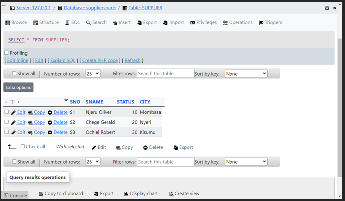

3. Qualified retrieval -  Get supplier numbers for suppliers in Paris with status > 20
```
SELECT SNO FROM SUPPLIER WHERE CITY  =  ‘Kisumu’ AND STATUS > 20
```
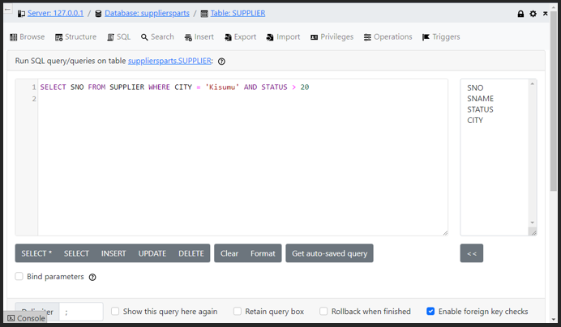
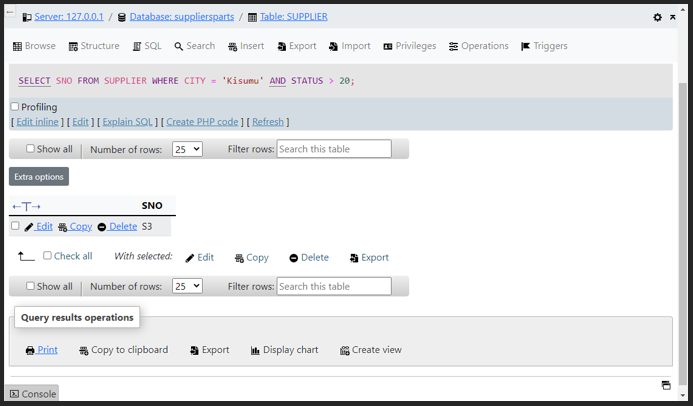

4. Retrieval with ordering - Get supplier numbers and status for suppliers in Paris in descending order of status.

```
SELECT DISTINCT SNO,  STATUS FROM SUPPLIER WHERE CITY  =  ‘Nairobi’ ORDER BY STATUS DESC
```

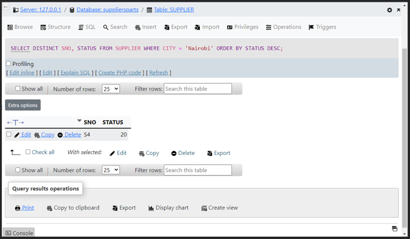

5. Retrieval from more than one table - For each part supplied, get part number and names of all cities supplying the part.

```
SELECT SHIPMENT. PNO, SUPPLIER. CITY FROM SHIPMENT, SUPPLIER WHERE SHIPMENT. SNO =  SUPPLIER. SNO
```

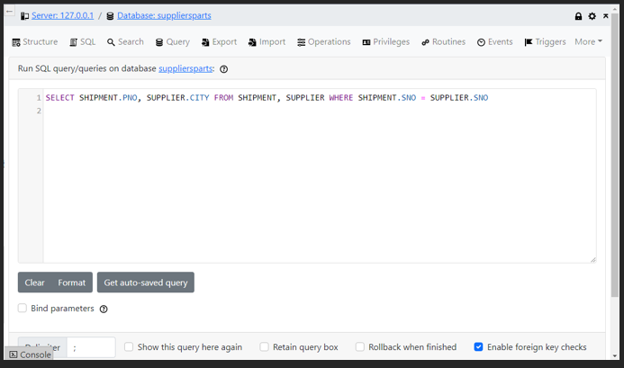
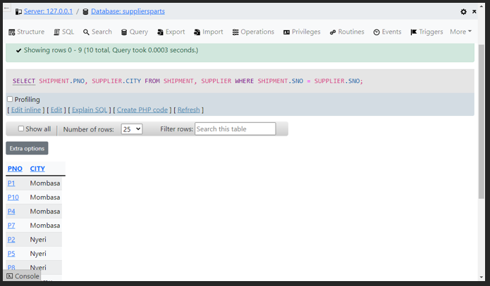

6. Retrieval involving a join of a table with itself  -  Get all pairs of supplier numbers such that two suppliers are locate in the same city.

```
SELECT FIRST. SNO , SECOND.  SNO FROM SUPPLIER FIRST, SUPPLIER SECOND WHERE FIRST.CITY = SECOND.CITY AND FIRST.SNO < SECOND.SNO
```

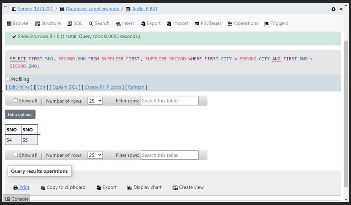

7. Retrieval using IN - Get supplier names for suppliers who supply part P2.

```
SELECT SNAME FROM SUPPLIER WHERE SNO IN (SELECT SNO FROM SHIPMENT WHERE PNO = ‘P2’);
```
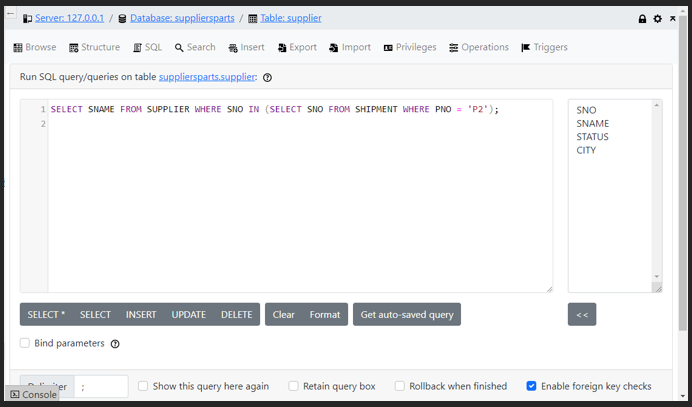
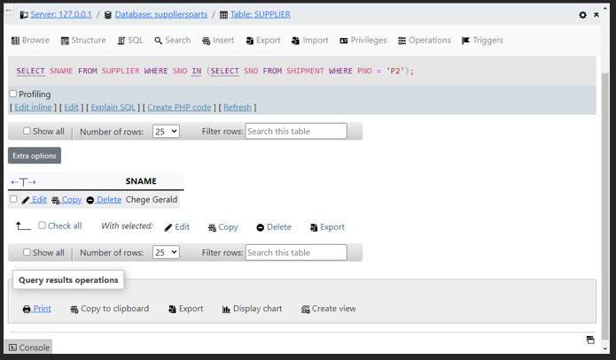

8. Retrieval with multiple levels of nesting - Get supplier names for suppliers who supply at least one red part.

```
SELECT SNAME FROM SUPPLIER WHERE SNO IN (SELECT SNO FROM SHIPMENT WHERE PNO = (SELECT PNO FROM PART WHERE COLOUR = ‘RED’
```

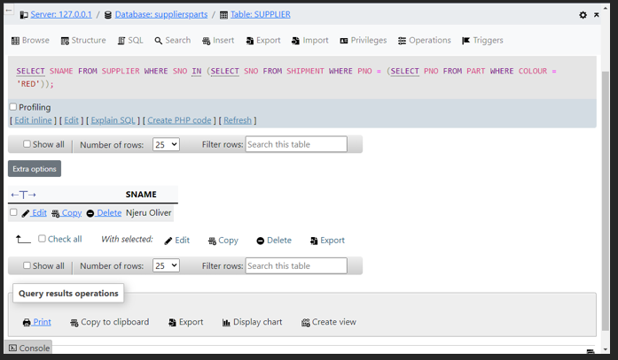

9. Retrieval using ALL - Get supplier names for suppliers who do not supply
part P2.

```
SELECT SNAME FROM SUPPLIER WHERE ‘P2’ <> ALL (SELECT PNO FROM SHIPMENT WHERE SNO = SUPPLIER. SNO)
```

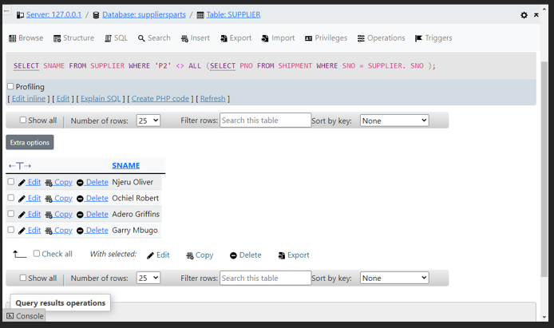

10. Retrieval using EXISTS - Get supplier names for suppliers who supply part P2.

```
SELECT SNAME FROM SUPPLIER WHERE EXISTS (SELECT * FROM SHIPMENT WHERE SNO = SUPPLIER. SNO AND PNO = ‘P2’)
```

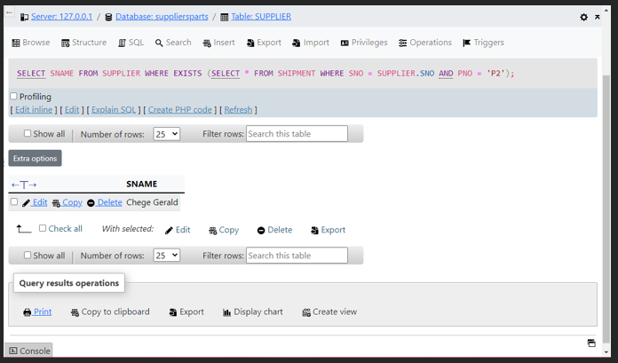
11. Retrieval using NOT EXISTS - Get supplier names for suppliers who do not supply part P2.

```
SELECT NAME FROM SUPPLIER WHERE NOT EXISTS (SELECT * FROM SHIPMENT WHERE SNO = SUPPLIER.SNO
AND PNO = ‘P2’)
```
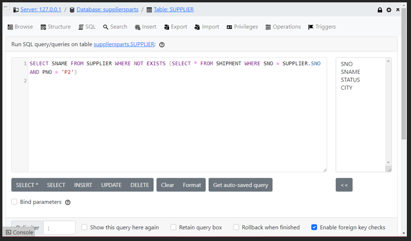
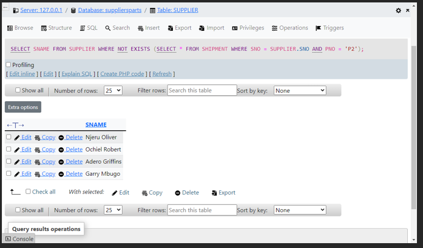

12. Functions in the SELECT clause - Get the total number of suppliers currently supplying parts.

```
SELECT COUNT(DISTINCT SNO) FROM SHIPMENT
```
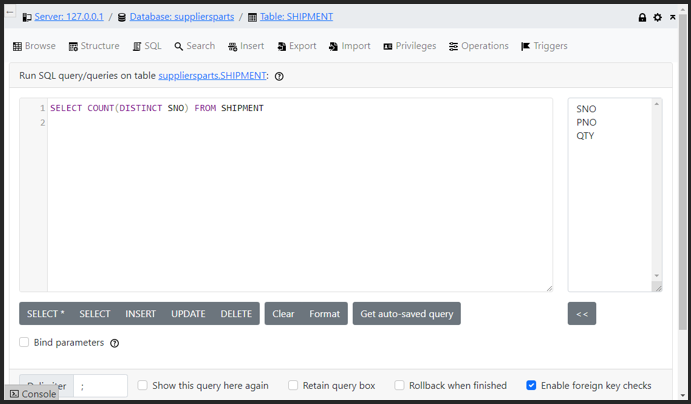
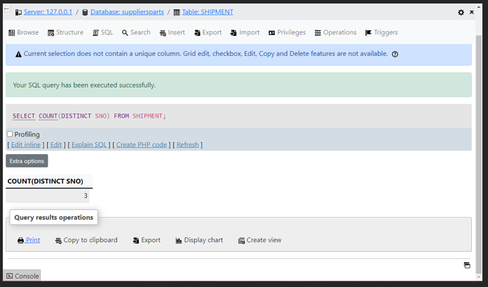

13. Function in the SELECT clause, with a predicate - Get the total quantity of part P2 supplied.

```
SELECT SUM (QTY) FROM SHIPEMENT WHERE PNO = ‘P2’
```
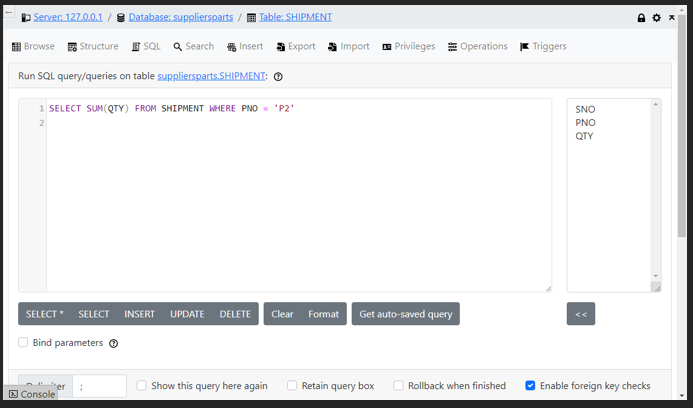
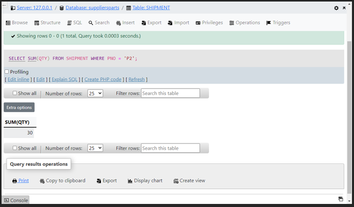

14. Function in a subquery – Get supplier names for suppliers with status value less than current maximum status value in the SUPPLIER table.

```
SELECT SNO FROM SUPPLIER WHERE STATUS<(SELECT MAX (STATUS) FROM SUPPLIER
```

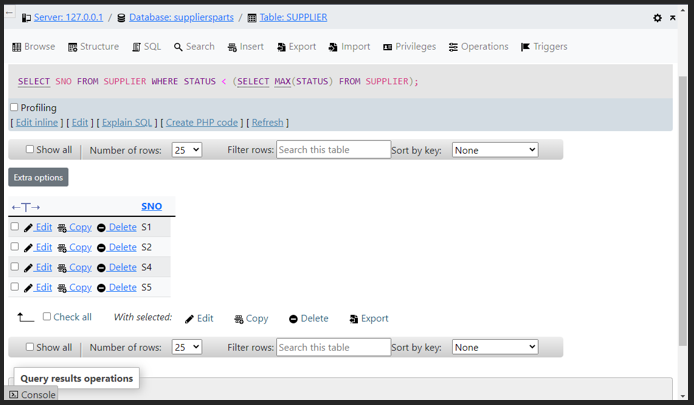

15. Use of GROUP BY – For each part supplied, get the part number and the total quantity supplied of that part.

```
SELECT PNO, SUM (QTY) FROM SHIPMENT GROUP BY PNO
```
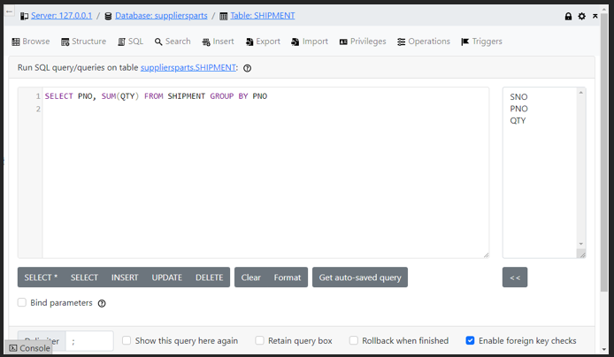
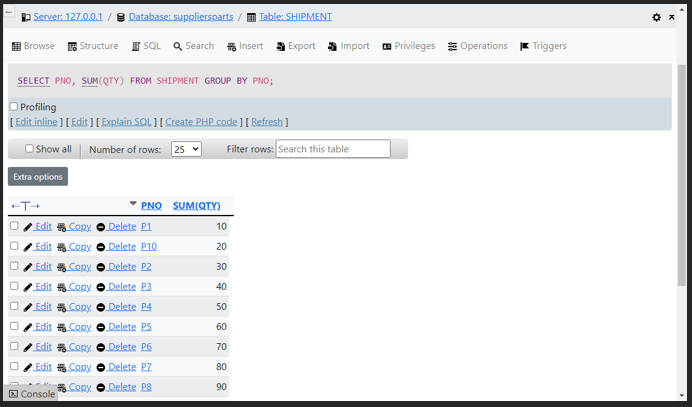

16. Use of GROUP BY with HAVING - Get part numbers for all parts supplied by more than one supplier.

```
SELECT PNO FROM SHIPMENT GROUP BY PNO HAVING COUNT (*) > 1
```

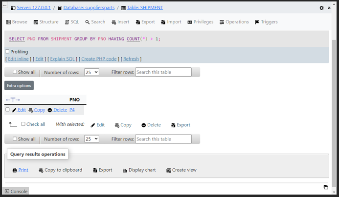
17.  Comprehensive example – For all parts such that the total quantity supplied is greater than 300 (excluding from the total all shipments for which the quantity is less than or equal to 200), get the part number and the maximum quantity of the part supplied; and order the result by descending part number within those maximum quantity values.

```
SELECT PNO, MAX (QTY) FROM SHIPMENT WHERE QTY => 200 HAVING SUM (QTY) > 300 ORDER BY 2, PNO DESC
```

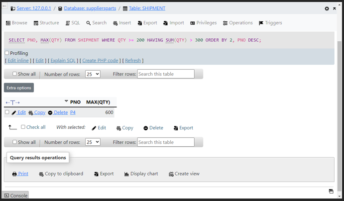

### INSERT

INSERT allows us to enter data into a table.  We can enter the data directly, transfer it via parameters, or select it from another table.  The general syntax is:

    INSERT INTO table_name
    [  ( field_name {, field_name}  ]
    [  VALUES (expression {,expression}  ]

Examples

1. Single-record insertion – Add part P7 (name ‘washer’, colour ‘GREY’ , weight 2, city ‘ATHENS’) to table PART.

```
INSERT INTO PART (PNO, PNAME, COLOUR, WEIGHT, CITY) VALUES (‘P7’ , ‘WASHER’ , ‘GREY’ , 2, ‘NAKURU’)
```
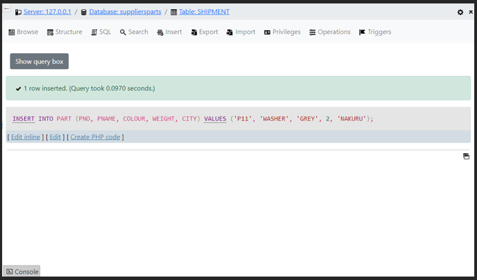

2. Multiple-record insertion – Table TEMP has one column, called PNO.  Enter into TEMP part numbers for all parts supplied by supplier S2.

```
INSERT INTO TEMP: SELECT PNO FROM SHIPMENT WHERE SNO = ‘S2’
```
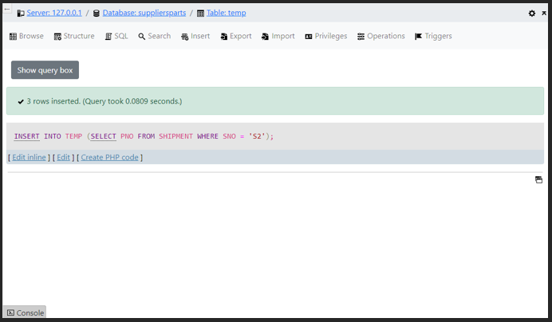

### UPDATE

The UPDATE command is used to change filed values.  General syntax is:

    UPDATE table_name
    SET field_name  =  new_value  [{,field_name  =  new_value}]…
    [  Where condition  ]

Examples

1.  Multiple record update  -  Double the status of all suppliers in London.

```
UPDATE SUPPLIER SET STATUS = 2 * STATUS WHERE CITY = ‘NAIROBI’
```

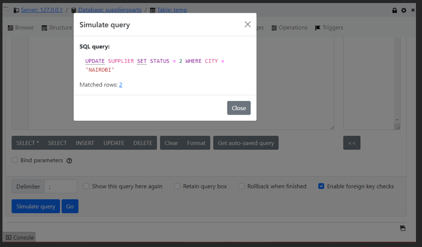


2. Update with a subquery – set the quantity to zero for all suppliers in London.

```
UPDATE SHIPMENT SET QTY = 0 WHERE ‘LONDON’ = (SELECT CITY FROM SUPPLIER WHERE SNO = SHIPMENT.SNO)
```
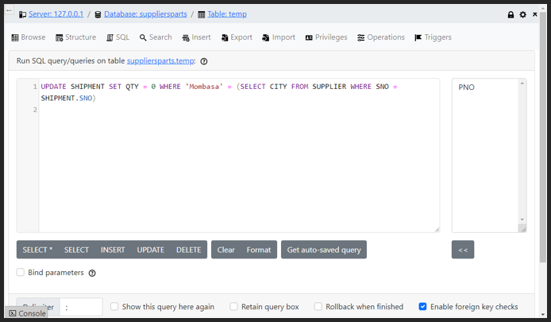
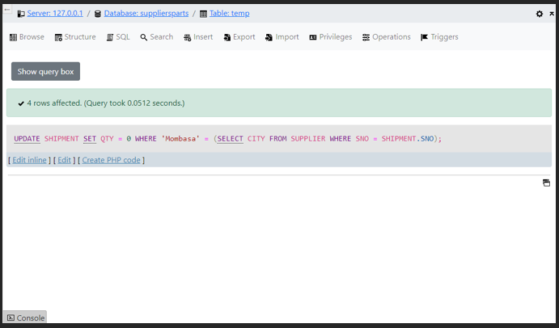

###	DELETE

The DELETE command removes records from a table.  General syntax is:

    DELETE FROM table_name
    [  WHERE condition  ]

If there is no WHERE condition all records are removed but the structure remains the same.
Examples

1.  Single-record deletion - Delete supplier  S1.

```
DELETE SUPPLIER WHERE SNO  = ‘S1’
```
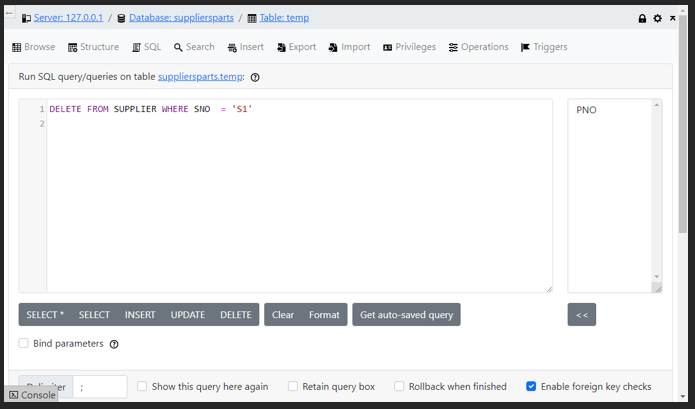
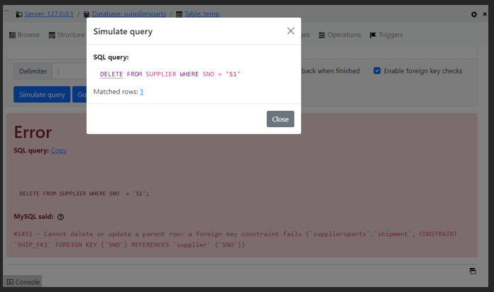
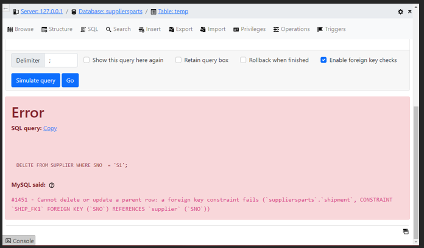

2.  Multiple – record, multiple table deletion - Delete all shipments from suppliers in London and also the suppliers concerned.

```
DELETE SHIPMENT WHERE ‘MOMBASA’ = (SELECT CITY
FROM SUPPLIER WHERE SNO = SHIPMENT.SNO)
```

```DELETE SUPPLIER WHERE CITY = ‘MOMBASA’
```

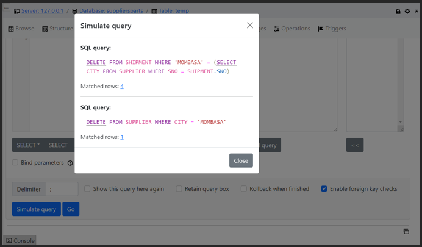

### VIEWS

A view can be defined as a virtual table – a table that does not exist on its won rights.  Views are not directly supported by their own physically stored data.

THE CREATE VIEW has the following general syntax:

    CREATE VIEW view_name [[  field ] [{, field}]…]
    AS SELECT [DISTINCT] [* I field1  [{, field2}]…]
    FROM table_name I VIEW_name
    [  WHERE condition  ]
    [  GROUP BY grouping_criteria  ]
    [  HAVING predicate  ]

To delete a view use the following command:

```
DROP VIEW view_name
```
There are restrictions on manipulating views, particularly when using UPDATE, INSERT OR DELETE.

## DATA CONTROL

The Data Control Language (DCL) commands are used to control user access to the database.  The DCL is concerned with privacy and security issues.  The DCL commands are:

GRANT - assign the status of
REVOKE - remove the status of

There are three user privileges or user types:

1.  CONNECT:  lowest privileges with the following facilities:
-	Access to the database
-	Right to manipulate publicly accessible data
-	Permission to access other people’s data only if allowed by owners.

2. RESOURCE: Intermediate level with the following facilities:
-	All rights that accrue to a CONNECT
-	The right to create tables, indexes and clusters
-	Permission to grant the rights to create tables, indexes and clusters  to other users
-	Permission to GRANT or REVOKE rights such as SELECT or UPDATE to own objects.
-	Perform auditing with own database objects

3. DBA: Highest authority with the following facilities:
-	All rights that accrue to CONNECT and RESOURCE
-	GRANT and REVOKE access privileges to the database
-	Perform all DDL, DML and DCL commands
-	Establish and change parameters of the database program
-	Establish and change database logical and physical structure
-	Backup database and regenerate damaged databases
-	Audit how users have used their rights and generally oversee database operations
-	See everything in the system data dictionary and make limited changes to it


## INDEXES AND CLUSTERS

The general syntax of the CREATE INDEX command is:

    CREATE [  UNIQUE  ] INDEX index_name
    ON table_name
    ( field_name  [ ASC I DESC ] [, field_name ] [ASC I DESC ]…])
    Example

To remove an index use the command

```
DROP INDEX index_name
```

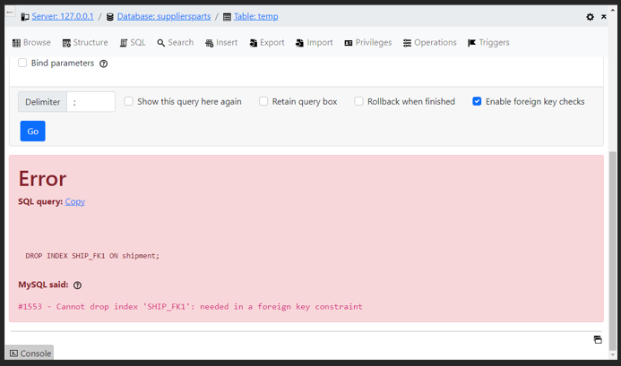

You can create a cluster by issuing a command such as:

    CREATE CLUSTER sale_employees
    (customer_no INTEGER)

## DATA DICTIONARY

The SQL system creates and maintains the data dictionary.  No user (not even the DBA) can create or delete data dictionary tables, but the DBA can only alter them to a very limited extent.  There are thus no CREATE, UPDATE DELETE or INSERT commands for the data dictionary.

Most data dictionary tables are accessible to everyone.  Users can extract data from them with the SELECT command.  By examining the data dictionary tables users can determine which indexes, tables or views they have created.  They can also determine the GRANTS they have issued.  The DBA can use the data dictionary most to check the daily operations of the database.

The data dictionary tables can be divided into three groups:

1. DATABASE OPERATION:  They contain information about what happens in the database as it operates.  They are called audit tables.  Primarily intended for the DBA.  For example the following command records all unsuccessful attempts to delete, select, alter or update records in the PART table.

AUDIT DELETE, SELECT, ALTER, UPDATE
ON part BY ACCESS WHENEVER NOT SUCCESSFUL

2.  DATABASE TABLES:  They contain information about the physical and logical organization of the databases.  This may include lists of tables and where they are physically stored.


## EMBEDDED SQL

SQL is a non-procedural language.  It is not intended for end-users but for application programmers and database administrators.  SQL’s weaknesses include:

-	Inability to handle user interaction (user interface)
-	Limited provisions for maintaining integrity
One way out of these weaknesses is to embed SQL statements in a high-level programming language (host language).  SQL statements can only be embedded in a language for which a pre-compiler is available.  Such tools exist only for certain combinations of SQL implementations, DBMS, compilers and operating systems.  Languages for which pre-compilers are available include 	Java, PhP, C++, C, Python, Pascal, FORTRAN, COBOL, C, Ada and PL/1.  Embedded SQL is also available on some procedural database languages such as Oracle, MySQL, PostGre, MS SQL Server.

An embedded SQL program consists of three parts:

-	declaration part
-	include part
-	program part

For example to delete a record from a CUSTOMER table:

EXEC SQL BEGIN DECLARE SECTION
INTEGER cno
EXEC SQL END DECLARE SECTION
EXEC SQL INCLUDE SQLCA

begin
	   print ( ‘ Enter number of customer to delete:’ ) read (cno) EXEC SQL DELETE FROM customers WHERE customer_no  =  : cno print ( ‘customer’ , cno, ‘ removed from database’) end

This is done in Lab 5 with Java via the Netbeans IDE

Embedded SQL can use all interactive SQL commands, as well as other commands for example:

(a) DECLARE – used to declare variables to host language (host variables).  The host variables are declared in a segment between the statements.

EXEC SQL BEGIN DECLARE SECTION

and

EXEC SQL END DECLARE SECTION

(b) SQLCA – SQL Communications Area is a set of variables used by the DBMS and host language to exchange information about the status of operations, for example:

EXEC SQL INCLUDE SQLCA
APPENDIX A – SQL COMMANDS

I.  SQL DDL COMMANDS

ALTER PARTITION Adds a file to database partition

ALTER SPACE Alters a space definition

ALTER TABLE Adds a column to, or redefines a column in, an existing table


COMMENT Inserts a comment about a table or column into data dictionary


CREATE CLUSTER Creates a cluster which may contain two or more tables


CREATE DATABASE Creates a link to user name in a remote database
LINK


CREATE INDEX Creates an index for a table


CREATE PARTITION Creates a new partition in the database

CREATE SPACE Creates a space definition which then may be used to define the space allocation properties of a table

CREATE SYNONYM Creates a synonym for a table or view name

CREATE TABLE Creates a table and defines its columns and other  properties

CREATE VIEW Defines a view of one or more tables or other views

DROP Deletes a table, view, index or cluster from the database


RENAME Changes the name of a table, view or synonym
II.  SQL DML COMMANDS

DELETE Deletes one or more rows from a table or view

INSERT Adds new rows to a table or view

SELECT Performs a query and selects rows and columns from one or more tables or views

UPDATE Changes the value of fields in a table or view

III.  SQL DCL COMMANDS

AUDIT Makes the DBMS audit use of a table, view, synonym, or system facility

COMMIT Makes a database transaction irreversible

GRANT Grants access to objects stored in database

LOCK TABLE Locks a table and thus permits shared access to the table by multiple users while simultaneously preserving the ‘tables integrity.’

NOAUDIT Partially or completely reverses the effect of prior AUDIT command.

REVOKE Revokes database privileges or table access privileges from a user

ROLLBACK Cancels database transactions

VALIDATE INDEX Checks the integrity of a ta