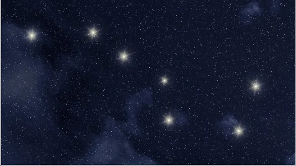
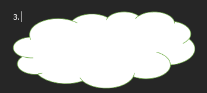
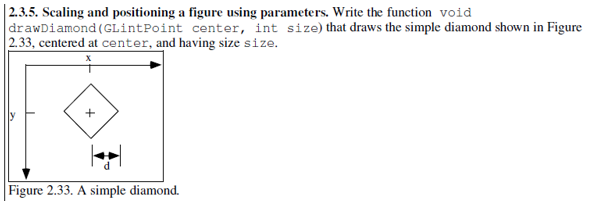
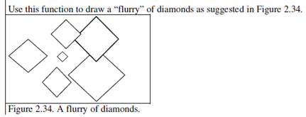
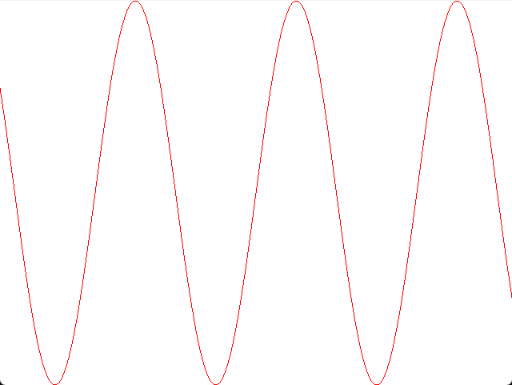
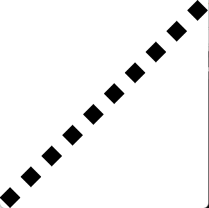

# LABS

## SimpleStatic Images
* Create the Image Below via OPENGL
    

    <a href="https://github.com/olivernjeru/apt/blob/main/apt2090/labs/draw-the-big-dipper/Untitled4.cpp">Code</a>

* Create the Image Below via OPENGL
    

    <a href="https://github.com/olivernjeru/apt/blob/main/apt2090/labs/draw-kenyan-flag/Untitled4.cpp">Code</a>

* Create the Image Below via OPENGL
    

    <a href="https://github.com/olivernjeru/apt/tree/main/apt2090/labs/draw-simple-house/Untitled4.cpp">Code</a>

* Create the Image Below via OPENGL
    

    <a href="https://github.com/olivernjeru/apt/tree/main/apt2090/labs/draw-cloud/Untitled4.cpp">Code</a>

* Create the Image Below via OPENGL
    

    <a href="https://github.com/olivernjeru/apt/tree/main/apt2090/labs/draw-simple-diamond/Untitled4.cpp">Code</a>

* Create the Image Below via OPENGL
    

    <a href="https://github.com/olivernjeru/apt/tree/main/apt2090/labs/draw-flurry-of-diamonds/Untitled4.cpp">Code</a>

* Create the Image Below via OPENGL
    

    <a href="https://github.com/olivernjeru/apt/tree/main/apt2090/labs/draw-graph-oscillations/Untitled4.cpp">Code</a>

* Draw a simple diamond at position 0.0, 0.0 and translate it multiple times as show below via OPENGL
    

    <a href="https://github.com/olivernjeru/apt/tree/main/apt2090/labs/draw-translation/Untitled4.cpp">Code</a>

## Simple Animations
* Rotating Rectangles
    <video src="labs/assets/animation-via-idle-function.mp4"/>

    <a href="https://github.com/olivernjeru/apt/tree/main/apt2090/labs/create-rotating-rectangles-animation/Untitled4.cpp">Code</a>

* Bouncing Ball Animation
    <video src="labs/assets/bouncing-ball.mp4"/>

    <a href="https://github.com/olivernjeru/apt/tree/main/apt2090/labs/create-bouncing-ball-animation/Untitled4.cpp">Code</a>