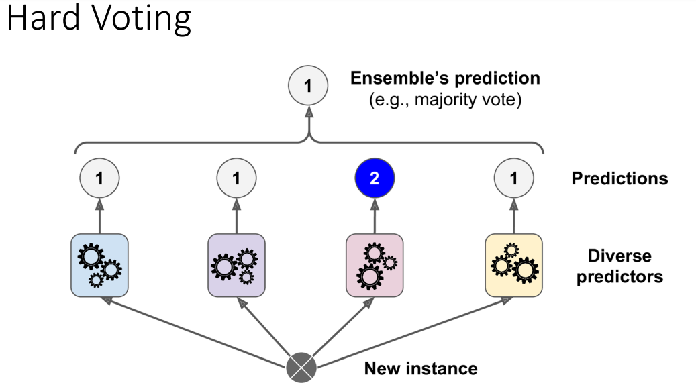
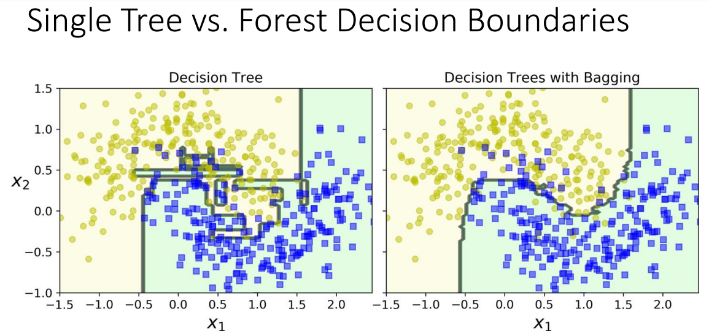

# Ensemble

A group of predictors is called an Ensemble thus this technique of having a group of predictors such as classifiers or regressors is Ensemble Learning and an Ensemble Learning algorithm is called an Ensemble method

## Ensemble Learning with Multiple Decision Trees (A.K.A Random Forest)
To implement Ensemble Learning, we can use multiple decision trees. How do we do this? We get a group of decision tree classifiers and train each on different random subsets of the training set. Once we get the predictions, we get the aggregate of this predictions from each individual tree then predict the class that gets the most votes.
Such an Ensemble of Decision Trees is called a Random Forest and despite its simplicity, it is one of the most powerful Machine Learning algorithms available today.

## Random Forest
Is an Ensemble of Decision Trees and despite its simplicity it is one of the most powerful machine learning algorithms available today

## Hard Voting Classifier
Suppose you have trained a few classifiers, each one achieving about 80% accuracy. These algorithms maybe be a Logistic Regression classifier, a Support Vector Machine classifier, a Random Forest classifier, a K-Nearest
Neighbors classifier, and perhaps a few more.

A very simple way to create an even better classifier is to aggregate (sum up) the predictions of each classifier and predict the class that gets the most votes. This majority-vote classifier is called a hard voting classifier

This voting classifier often achieves a higher accuracy than the best classifier in the ensemble.
In fact, even if each classifier is a weak learner (meaning it does only slightly better than random
guessing), the ensemble can still be a strong learner (achieving high accuracy), provided there are a
sufficient number of weak learners and they are xsufficiently diverse.

## Soft Voting
If all classifiers are able to estimate class probabilities (i.e., they all have a predict_proba()
method), then you can tell Scikit-Learn to predict the class with the highest class probability, averaged over all the individual classifiers. This is called soft voting.
Soft often achieves higher performance than hard voting because it gives more weight to highly confident votes. All you need to do is replace voting="hard" with voting="soft" and ensure that all classifiers can estimate class probabilities.

## Bagging and Pasting
One way to get a diverse set of classifiers is to use the same training algorithm for every predictor and train them on different random subsets of the training set.
Bagging (short for bootstrap aggregating) is when sampling is performed with Replacement while pasting is when sampling is performed without replacement.

### Predicting with Bagging and Pasting
Once all predictors are trained, the ensemble can make a prediction for a new instance by simply aggregating the predictions of all predictors.
The aggregation function is typically the statistical mode (i.e., the most frequent prediction, just like a hard voting classifier) for classification, or the average for regression.

### Training and Predicting in Parallel
Predictors in an ensemble can all be trained in parallel, via different CPU cores or even different
servers. Similarly, predictions can be made in parallel. This is one of the reasons bagging and pasting are
such popular methods: they scale very well.

### Bagging and Pasting in Scikit-Learn
Scikit-Learn offers a simple API for both bagging and pasting with the BaggingClassifier class (or BaggingRegressor for regression).

## Single Tree vs Forest
The figure below compares the decision boundary of a single Decision Tree with the decision boundary of a bagging ensemble of 500 trees (from the preceding code), both trained on the moons dataset.
As you can see, the ensemble’s predictions will likely generalize much better than the single Decision Tree’s predictions.

## Random Forests
A Random Forest is an ensemble of Decision Trees, generally trained via the bagging method (or sometimes pasting), typically with max_samples set to the size of the training set.
Instead of building a BaggingClassifier and passing it a DecisionTreeClassifier, you can instead use the
RandomForestClassifier class, which is more convenient and optimized for Decision Trees (similarly, there is a
RandomForestRegressor class for regression tasks).

## Boosting
Refers to any Ensemble method that can combine several weak learners into a strong learner.
The general idea of most boosting methods is to train predictors sequentially, each trying to correct its predecessor.
There are many boosting methods available, but by far the most popular are AdaBoost (short for Adaptive Boosting) and Gradient Boosting.
