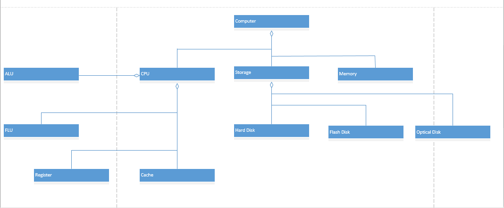
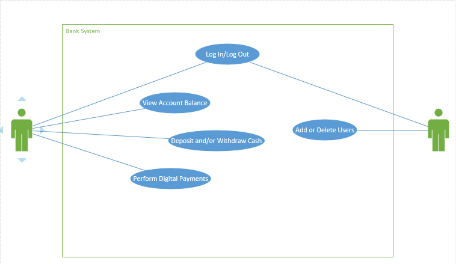
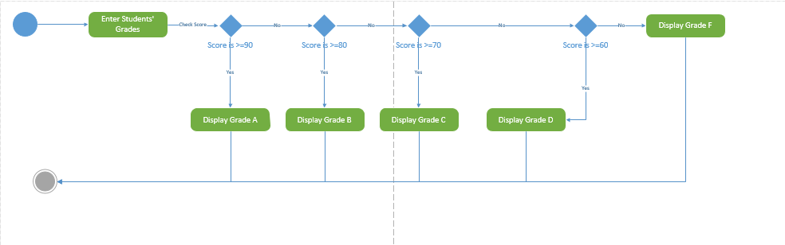

# System Design

* Aggregation
    * This is an illustration of Aggregation in a UML Class Diagram
        
* Bank Use Case Diagram
    * This is an illustration of a small feature in a Bank Use Case Diagram
        
* Grading UML Activity Diagram
    * This is an illustration of a grading feature via a UML Activity Diagram
        
* Printer UML Class Diagram
    * This is an illustration of Inheritance and Aggregation implemented in a printer's UML Class Diagram
        
* Notes
    * UML Xtics
        <ul>Has diagrams used for analysis and design</ul>
        <ul>doesn’t include a software process</ul>
        <ul>supports inheritance, whole part, association, aggregation, composition</ul>
        <ul>UML design models can be implemented in any programming language or platform</ul>
    * Advantages
        <ul>Software reuse</ul>
        <ul>Flexibility due to polymorphism</ul>
        <ul>Security due to information hiding</ul>
        <ul>Easy maintenance due to modularity</ul>
    * Disadvantages
        <ul>Step Learning curve</ul>
        <ul>Cannot be used to solve all problems</ul>
        <ul>Slow execution due to message passing and larger programs</ul>
    * Activity Diagrams
        <ul>Has start and end symbol</ul>
        <ul>Has activity/action</ul>
        <ul>Has note/comment symbol</ul>
    * UML Full Class Diagrams
        <ul>Has three partitions:</ul>
            * Name
            * Attributes
            * Methods
    * Use Case Diagrams
        <ul>Has subsystem name</ul>
        <ul>Has actor name</ul>
        <ul>Has use case name</ul>
        <ul>Has association name</ul>

* A Successful Scenario for borrowing a book at the library
    
User goes to the Library

    
Library is Open

    
User goes to shelf to get book

    
User picks book

    
User gives book to librarian

    
Librarian records book record update

    
Librarian gives book to the user
