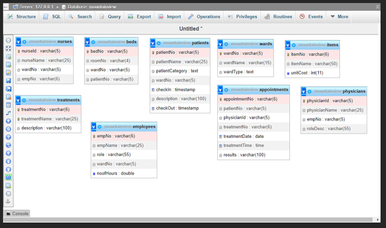
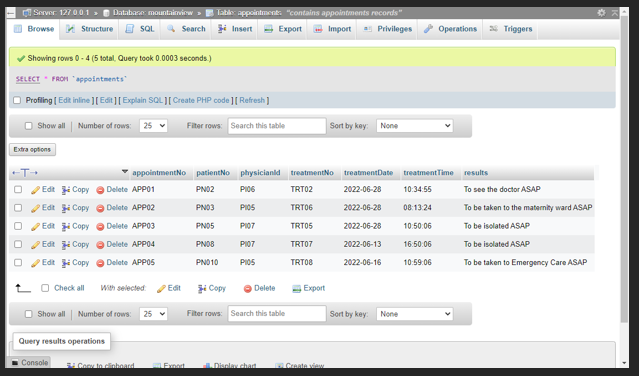
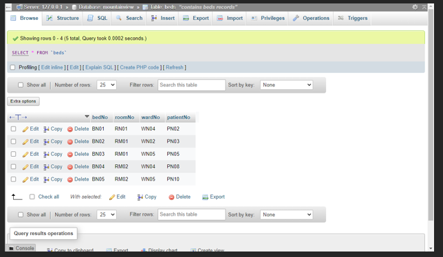
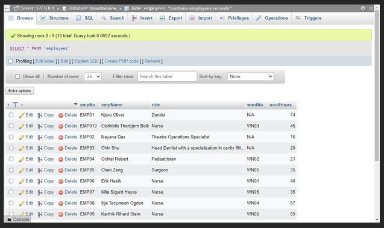
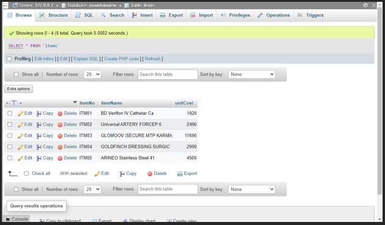
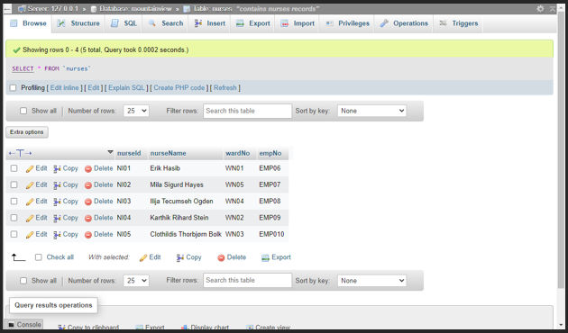
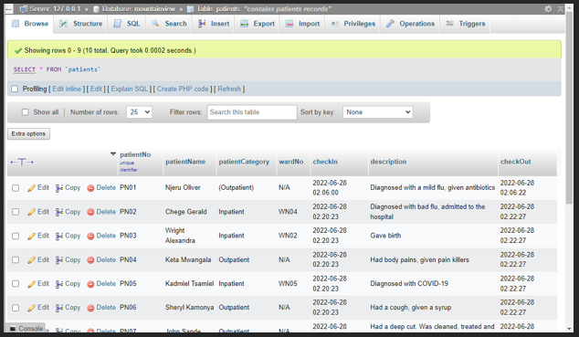
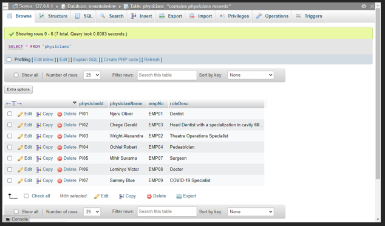
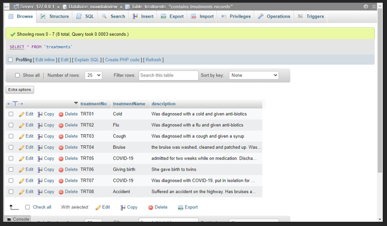
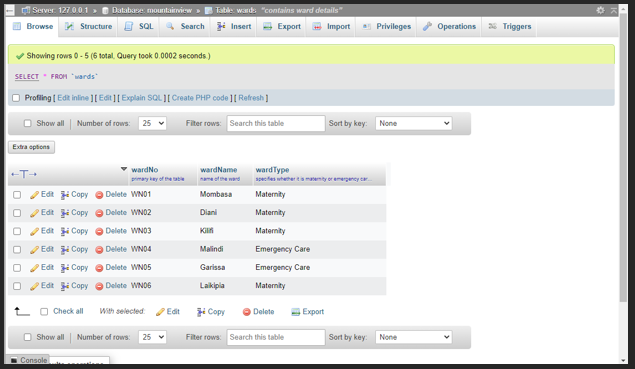

# Assignment 3

<p>a)Develop the database for the Mountain View Hospital with all the tables and business rules explained above. (Get screen captures of the DB design and copy into Word for submission).</p>


<p>b)Populate the tables with sample data (ensure referential integrity in the data samples); Insert at least 10 records into the Patient table and 5 records in each of all the other  tables. Ensure one of the patients contains your particulars – a record with your name is mandatory. (Get screen captures of the inserted data in browse mode and copy into the word document for submission);

Appointments
</p>


<p>Beds</p>


<p>Employees</p>


<p>Items</p>


<p>Nurses</p>


<p>Patients</p>


<p>Physicians</p>


<p>Treatments</p>


<p>Wards</p>


<p>c)Use SQL to:</p>

* Write at least one data insertion SQL statement for each of  the tables; Copy your SQL statement and result into the word document for submission;
    * Appointments
        ```
        INSERT INTO `appointments` (`appointmentNo`, `patientNo`, `physicianId`, `treatmentNo`, `treatmentDate`, `treatmentTime`, `results`) VALUES ('APP05', 'PN010', 'PI05', 'TRT08', '2022-06-16', '22:48:44', 'To be taken to Emergency Care ASAP')
        ```
        <p>The result is the values after VALUES in the brackets, from ‘APP05’ to ‘To be taken to Emergency Care ASAP’ will be inserted in the appointments table from ‘appointmentNo’ column to ‘results’ column respectively</p>

    * Beds
        ```
        INSERT INTO `beds` (`bedNo`, `patientNo`, `roomNo`, `wardNo`, `patientNo`) VALUES ('BN05', 'RM02', 'WN05', 'PN10')
        ```
        <p>The result is the values after VALUES in the brackets, from ‘BN05’ to ‘PN10’ will be inserted in the beds table from ‘bedNo’ column to ‘patientNo’ column respectively</p>

    * Employees
        ```
        INSERT INTO `employees` (`empNo`, `empNo`, `role`, `wardNo`, `noofHours`) VALUES ('EMP01', 'Njeru Oliver', 'Dentist', 'WN04', '14')
        ```
        <p>The result is the values after VALUES in the brackets, from ‘EMP01’ to ‘14’ will be inserted in the employees table from ‘empNo’ column to ‘noofHours’ column respectively</p>

    * Items
        ```
        INSERT INTO `items` (`itemNo`, `itemName`, `unitCost`) VALUES ('ITM05', 'ARINEO Stainless Steel 41', '4500')
        ```
        <p>The result is the values after VALUES in the brackets, from ‘ITM05’ to ‘4500’ will be inserted in the items table from ‘itemNo’ column to ‘unitCost’ column respectively</p>

    * Nurses
        ```
        INSERT INTO `nurses` (`nurseId`, `nurseName`, `wardNo`, `empNo`) VALUES ('NI04', 'Karthik Rihard Stein', 'WN02', 'EMP09')
        ```
        <p>The result is the values after VALUES in the brackets, from ‘NI04’ to ‘EMP09’ will be inserted in the nurses table from ‘nurseId’ column to ‘empNo’ column respectively</p>

    * Patients
        ```
        INSERT INTO `patients` (`patientNo`, `patientName`, `patientCategory`, `wardNo`, `checkIn`, `description`, `checkOut`) VALUES ('PN08', 'Taigu Wachira', 'Inpatient', 'WN04', '2022-06-28 02:20:23', 'Diagnosed with COVID-19', ''2022-06-28 02:22:27')
        ```
        <p>The result is the values after VALUES in the brackets, from ‘PN08’ to ‘2022-06-28 02:22:27’ will be inserted in the employees table from ‘patientNo’ column to ‘checkOut’ column respectively</p>

    * Physicians
        ```
        INSERT INTO `physicians` (`physicianId`, `physicianName`, `empNo`, `roleDesc`) VALUES ('PI07', 'Sammy Blue', 'EMP09', 'COVID-19 Specialist')
        ```
        <p>The result is the values after VALUES in the brackets, from ‘PI07’ to ‘COVID-19 Specialist’ will be inserted in the employees table from ‘physicianId’ column to ‘roleDesc’ column respectively</p>

    * Treatments
        ```
        INSERT INTO `treatments` (`treatmentNo`, `treatmentName`, `description`) VALUES ('TRT08', 'Accident', 'Suffered an accident on the highway. Has bruises all over, internal bleeding and a fractured leg')
        ```
        <p>The result is the values after VALUES in the brackets, from ‘TRT08’ to 'Suffered an accident on the highway. Has bruises all over, internal bleeding and a fractured leg' will be inserted in the employees table from ‘treatmentNo’ column to ‘description’ column respectively</p>

    * Wards
        ```
        INSERT INTO `wards` (`wardNo`, `wardName`, `wardType`) VALUES ('WN06', 'Laikipia', 'Maternity')
        ```
        <p>The result is the values after VALUES in the brackets, from ‘WN06’ to ‘Maternity’ will be inserted in the employees table from ‘wardNo’ column to ‘wardType’ column respectively</p>

<p>ii) Write some five SQL queries to retrieve data from the database so as to include data from more than one table in a given query; the queries are of your own choice. At least one query should retrieve the record with your name as a patient.</p>

    ```
    CREATE VIEW patientward AS
    SELECT patients.patientName, patients.patientCategory, wards.wardNo, wards.wardName, patients.description
    FROM patients, wards
    WHERE patients.patientName='Oliver Njeru';
    SELECT * FROM patientward
    ```

<p>The result will be patientName, patientCategory, wardNo, wardName and description where the patient name is Oliver Njeru</p>

```
CREATE VIEW bedsward AS
SELECT beds.bedNo, beds.roomNo, beds.wardNo, wards.wardName
FROM beds, wards
WHERE beds.wardNo='WN02';
SELECT * FROM bedsward

```

<p>The result will be bedNo, roomNo, wardNo, wardName where the wardNo is WN02</p>

```
CREATE VIEW employeesward AS
SELECT employees.employeeName, employees.role, wards.wardName
FROM employees, wards
WHERE employees.role='Nurse';
SELECT * FROM employeesward

```

<p>The result will be employeeName, role, wardName where the employeesrole is Nurse</p>

```
CREATE VIEW appointmentspatient AS
SELECT appointments.appointmentNo, appointments.patientNo, patients.patientName
FROM appointments, patients
WHERE appointments.patientNo ='PN02';
SELECT * FROM appointmentspatient

```

<p>The result will be appointmentNo, patientNo, patientName where the patientNo is PN02</p>

```
CREATE VIEW appointmentsphysicians AS
SELECT appointments.appointmentNo, appointments.physicianId, physicians.physicianName
FROM appointments, physicians
WHERE appointments.patientNo ='PI05';
SELECT * FROM appointmentsphysicians

```

<p>The result will be appointmentNo, physicianId, physicianName where the patientNo is PI05</p>