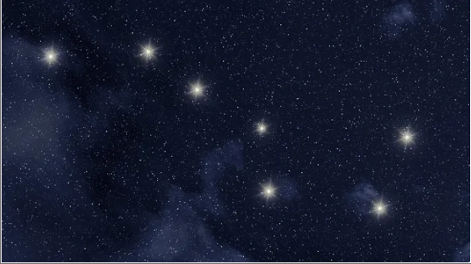
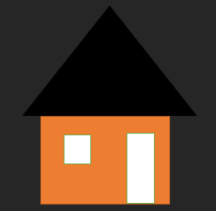
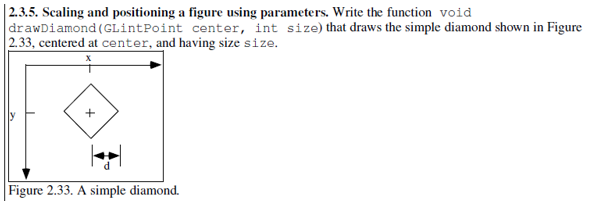
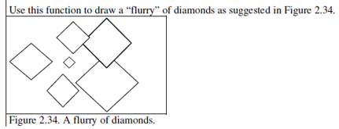
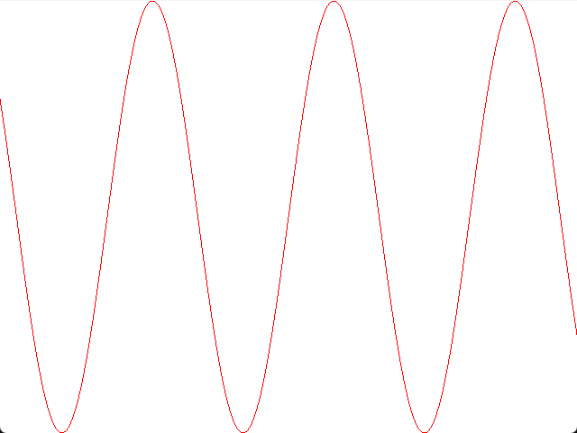
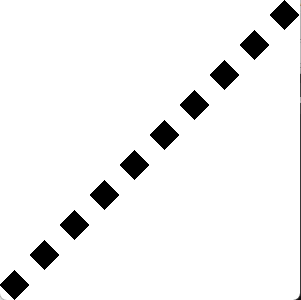

# LABS

## Static Images

- Big Dipper (OpenGL)

    

    [Code](https://github.com/olivernjeru/apt/blob/main/major/apt2090/labs/draw-the-big-dipper/Untitled4.cpp)

- Kenyan Flag (OpenGL)

    

    [Code](https://github.com/olivernjeru/apt/blob/main/major/apt2090/labs/draw-kenyan-flag/Untitled4.cpp)

- Simple House (OpenGL)

    

    [Code](https://github.com/olivernjeru/apt/tree/main/major/apt2090/labs/draw-simple-house/Untitled4.cpp)

- Cloud (OpenGL)

    

    [Code](https://github.com/olivernjeru/apt/tree/main/major/apt2090/labs/draw-cloud/Untitled4.cpp)

- Simple Diamond (OpenGL)

    

    [Code](https://github.com/olivernjeru/apt/tree/main/major/apt2090/labs/draw-simple-diamond/Untitled4.cpp)

- A Flurry of Diamonds (OpenGL)

    

    [Code](https://github.com/olivernjeru/apt/tree/main/major/apt2090/labs/draw-flurry-of-diamonds/Untitled4.cpp)

- Graph Oscillations (OpenGL)

    

    [Code](https://github.com/olivernjeru/apt/tree/main/major/apt2090/labs/draw-graph-oscillations/Untitled4.cpp)

- Translation Exercise (OpenGL)

    

    [Code](https://github.com/olivernjeru/apt/tree/main/major/apt2090/labs/draw-translation/Untitled4.cpp)

## Simple Animations

- Rotating Rectangles

    [Video](https://user-images.githubusercontent.com/51198797/207347066-04b591f3-2aa8-45c6-88c3-67fe6208c2ab.mp4)

    [Code](https://github.com/olivernjeru/apt/tree/main/major/apt2090/labs/create-rotating-rectangles-animation/Untitled4.cpp)

- Bouncing Ball Animation

    [Video](https://user-images.githubusercontent.com/51198797/207347373-4e4424ba-3f87-4c4b-bcd6-d6e23f476541.mp4)

    [Code](https://github.com/olivernjeru/apt/tree/main/major/apt2090/labs/create-bouncing-ball-animation/Untitled4.cpp)
