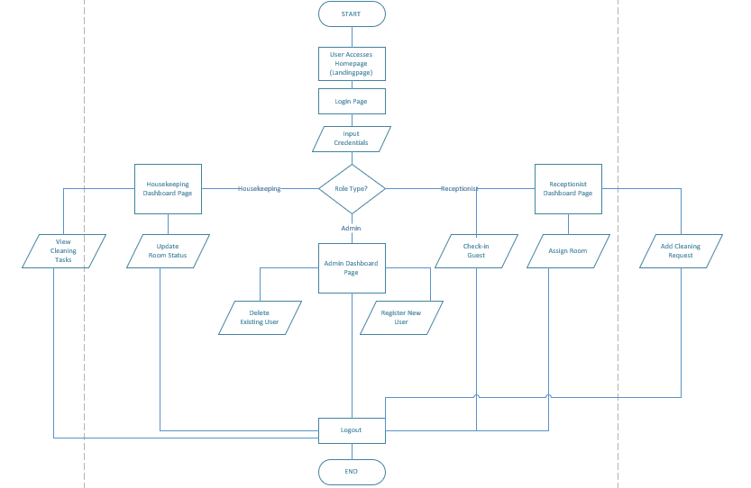

# Contributing Guidelines

Welcome to our APP4035 Project 1! These guidelines are designed to streamline collaboration and ensure high-quality contributions. Please read and follow these instructions before submitting any changes.

## Table of Contents

- [Getting Started](#getting-started)
- [Branching Strategy](#branching-strategy)
- [Commit Guidelines](#commit-guidelines)
- [Pull Request Process](#pull-request-process)
- [Code Reviews](#code-reviews)
- [Issue Management](#issue-management)
- [Reverting or Removing Changes](#reverting-or-removing-changes)
- [Additional Best Practices](#additional-best-practices)
- [Communication](#communication)
- [System Architecture and Flow](#system-architecture-and-flow)

## Getting Started

- **Repository Sync:**
  Always ensure your local repository is updated by pulling the latest changes from the `main` branch before starting new work.

- **Prerequisites:**
  Familiarize yourself with basic Git commands such as `clone`, `pull`, `push`, `branch`, `checkout`, and `merge`. If you’re unsure about any process, please ask one either Victor or I for guidance.

## Branching Strategy

- **Never work directly on the `main` branch.**
  Create a new branch for each feature, bug fix, or improvement.

- **Naming Conventions:**
  - Feature branches: `feature/short-description`
  - Bug fix branches: `bugfix/short-description`
  - Hotfix branches: `hotfix/short-description`

- **Branch Updates:**
  Regularly merge or rebase the latest `main` changes into your branch to avoid conflicts later.

## Commit Guidelines

- **Write Clear Commit Messages:**
  A well-written commit message should include a short summary followed by a more detailed explanation if necessary.

**Format:**

```markdown
  feat: Add user authentication module

  This commit adds a new module for user authentication using express-sessions.
  ```

**Common Types:**

- `feat`: Introduces a new feature.
- `fix`: Addresses a bug or issue.
- `docs`: Changes to documentation.
- `style`: Code formatting or style changes.
- `refactor`: Code restructuring without changing functionality.
- `test`: Adding or modifying tests.

- **Atomic Commits:**
Each commit should represent a single, logical change. This makes it easier to review, revert, or cherry-pick changes if needed.

## Pull Request Process

**Opening a PR:**

- Always open a pull request (PR) from your feature/bugfix branch to the `main` branch.
- Include a descriptive title and detailed description. Reference any related GitHub Issues using the `#issueNumber` format.

**Review Assignments:**

- Request reviews from either one of us.
- Even if you’re a mid-level GitHub contributing user, always seek a second pair of eyes for your PR.

**Before Merging:**

- Ensure your branch is up-to-date with `main`.
- Address all review comments.
- Confirm that all tests pass.

## Code Reviews

**Review Etiquette:**

- Provide constructive, clear, and respectful feedback.
- Focus on the code’s functionality, readability, and adherence to our coding standards.

**Review Responsibilities:**

- Advanced team members (Victor and I) should help guide the mid-level users through the review process.
- Resolve any issues or conflicts collaboratively before merging.

## Issue Management

**Tracking Work:**

- Use GitHub Issues to document bugs, feature requests, and other tasks.
- Always reference the related issue in your commit messages and PR descriptions.

      Example: "fix: Corrected validation logic (fixes #42)"

**Assignment:**

- When you begin working on an issue, assign it to yourself to avoid duplicated effort.

## Reverting or Removing Changes

**Undoing Mistakes:**

- If a pushed change needs to be removed, first consult with an advanced team member (Victor and I).
- Use `git revert` for safe reversions rather than rewriting published history.

**Document the Reversion:**

- Clearly explain in the commit message or PR why the change is being reverted to maintain clarity for future reference.

## Additional Best Practices

**Testing (This is optional by the way):**

- Write and run tests for your changes. Ensure that your modifications do not break existing functionality.

**Documentation:**

- Update documentation as needed to reflect your changes.

**Conflict Resolution:**

- Handle merge conflicts locally, test thoroughly after resolving, and then push your changes.

**Backup and Sync:**

- Regularly push your work to avoid loss of progress and to keep your branch synchronized with the team’s progress.

## Communication

**Regular Updates:**

- Keep the team informed about your progress, challenges, or any deviations from the planned workflow.

**Ask for Help:**

- If you’re uncertain about any process or guideline, please reach out to the team. Effective communication is key to our success.

## System Architecture and Flow

This project is designed to streamline hotel operations by managing check-ins, room assignments, and housekeeping tasks. The system targets two main user roles: Receptionist and Housekeeping Staff.

### Overview

#### User Authentication

- Users (Receptionists and Housekeeping Staff) must log in with their credentials.
Authentication is managed using sessions (via express-sessions).
Role-Based Dashboards:

- After login, the system verifies the user’s role.

- Receptionists are directed to a dashboard where they can:

  - Check in guests.

  - Assign rooms.

  - Add cleaning requests.

  - Track room statuses (e.g., view which rooms are ready for new guests).

  - Housekeeping Staff are directed to a dashboard where they can:

  - View pending room cleaning tasks.

  - Update room statuses once cleaning is complete.

#### Data Persistence

All data (guest details, room assignments, cleaning requests, etc.) is stored locally using JSON files.

#### Routing & Templating

- The system is built using Node.js with Express as the backend framework.

- Handlebars (hbs) is used as the templating engine.

- Static assets (e.g., CSS from Bootstrap) are served from the public directory.

#### Flowchart

Below is a high-level flow chart depicting the overall system flow:


---

Thank you for adhering to these guidelines and contributing to a smooth and collaborative workflow. Happy coding!
